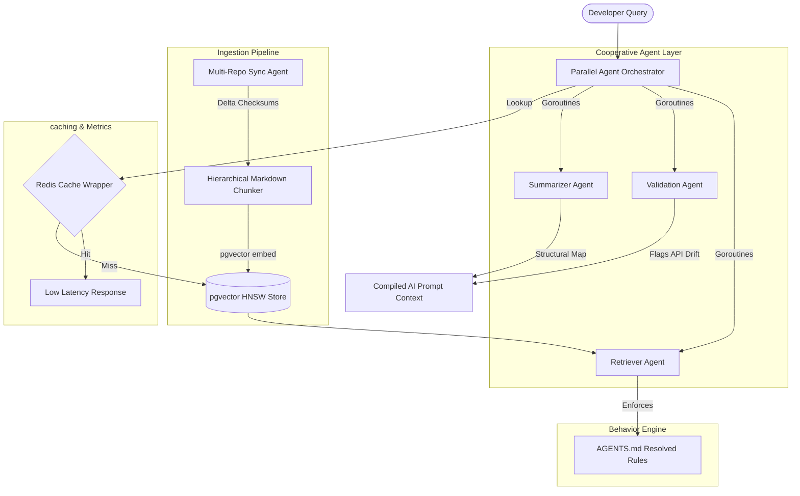

# ContextMesh (Agentic Context Engineering Platform)

[](https://github.com/Priyasharma620064/contextmesh/actions/workflows/ci.yml)
[](https://opensource.org/licenses/MIT)
[](https://modelcontextprotocol.io)

ContextMesh is an **Agentic Context Engineering Platform** that orchestrates cooperative agents for documentation retrieval, schema validation, multi-repository synchronization, and AI-ready knowledge compilation across cloud-native OSS ecosystems.

---

## 🎯 Core Problem & Vision

### The Problem
Modern Cloud-Native open-source ecosystems (Kubernetes, Helm, Volcano, OpenKruise) suffer from **severe context fragmentation**:
1. **API Schema Drift**: Outdated documentation manifests pointing to deprecated apiVersions (e.g., `extensions/v1beta1` Deployments) break automation pipelines.
2. **Disconnected Repositories**: Retrievals are naive, lacking branch-aware or release-aware boundaries, overflowing LLM context windows with noisy, stale text.
3. **Unvalidated Citations**: AI systems hallucinate answers due to a lack of precise line-level context citation confidence and quality checks.

### The Goal
ContextMesh bridges the gap between OSS documentation and AI-assisted engineering by placing repository-level **AGENTS.md behavior rules** in charge of a semantic retrieval and validation network.



---

## 💡 Why ContextMesh Exists: Example Workflow

A typical workflow demonstrates how ContextMesh coordinates documentation context dynamically:

**The Goal**: A developer queries:
> *"How does CloneSet rolling update work in OpenKruise v1.6?"*

**The ContextMesh Execution**:
1. **Multi-Repo Sync**: The Sync Agent fetches and processes `openkruise/kruise` docs on branch `release-1.6`.
2. **Behavior Policy Enforcement**: The Retriever Agent reads the repository-level `AGENTS.md` rules and dynamically applies a **+25% relevance boost** to any matching paths under `/docs/core/` while filtering out files matching `*.tmp` or `/temp/` paths.
3. **Hierarchical Chunking**: The Markdown Chunker segments `docs/core/cloneset.md` into precise chunks, preserving parent heading hierarchies (`Core Platform > Controller > CloneSet`).
4. **Manifest Schema Audit**: The Validation Agent scans YAML manifests in the chunk, detects a deprecated apiVersion (e.g., `apps.kruise.io/v1alpha1` Deployments), flags the drift, and injects a structured **suggested fix** directly into the context metadata.
5. **Token Compression**: The Budget Compressor scores the resolved chunks, ranks them, and drops lower-priority blocks to compress the context strictly within the requested `max_tokens` (4,000) ceiling.
6. **AI-Ready Prompt Generation**: The Orchestrator compiles the final context prompt, complete with verified XML citations (`CIT-xxxxxx`), and returns the optimized package to the LLM.

---

## 🚀 Key Standout Differentiators

### 1. Retrieval Evaluation Benchmark Suite
Unlike basic search apps, ContextMesh includes an evaluation engine to compare strategy outputs against a gold-standard dataset:
- **Strategy A (ContextMesh)**: Hierarchical markdown chunking (preserves heading hierarchies).
- **Strategy B (Traditional RAG)**: Naive flat block splitting.
- **Computed Metrics**: **Precision@K**, **Recall@K**, **Hallucination Risk Score** (based on document term coverage overlaps), **Citation line range confidence**, and latency.

### 2. Multi-Repository Incremental Sync & Delta Checksums
Simulates Git webhook ingestion with branch-aware and release-aware delta updates:
- Uses **MD5 content checksums** to parse changes.
- Automatically isolates files to index or ignore based on rules evaluated directly from `AGENTS.md`.

---

## 🛠️ Monorepo Architecture Overview

### 1. `AGENTS.md` Parser & Behavior Engine
Located in [backend/pkg/parser](file:///home/priya-sharma/contextmesh/backend/pkg/parser), this compiler reads repository-level YAML-like rule sets, resolves global ignore overrides, and maps scoped branch priorities (e.g., boosting `docs/core/` matching on `main` branch by 25%).

### 2. Parallel Agent Orchestrator
Located in [backend/pkg/agents](file:///home/priya-sharma/contextmesh/backend/pkg/agents), this layer runs Retriever, Validator, and Summarizer routines concurrently inside Go goroutines using channel sync gates and strict `context.WithTimeout` boundaries (4.0s) to prevent resource blocking.

### 3. Context Engineering Pipeline
- **Hierarchical Markdown Chunker** ([backend/pkg/pipeline/chunker.go](file:///home/priya-sharma/contextmesh/backend/pkg/pipeline/chunker.go)): Splits text semantically while maintaining nested outline breadcrumbs.
- **Token Budget Compressor** ([backend/pkg/pipeline/compressor.go](file:///home/priya-sharma/contextmesh/backend/pkg/pipeline/compressor.go)): Computes semantic weight density (1 word ≈ 1.3 tokens) and trims low-scoring context elements to respect token quotas.

### 4. Kubernetes Manifest Intelligence
Located in [backend/pkg/k8s](file:///home/priya-sharma/contextmesh/backend/pkg/k8s), this engine parses manifest code blocks and YAML structures against target Kubernetes versions, highlighting deprecated resource versions (e.g., recommending changing `extensions/v1beta1` to `apps/v1`) with instant suggested fixes.

### 5. Model Context Protocol (MCP) Server
Exposes platform engines as standardized AI tools under `/mcp` complying with the Model Context Protocol JSON-RPC 2.0 SSE spec:
- `semantic_search`: Context retrieval.
- `validate_k8s_docs`: Automated manifests audits.
- `run_benchmarks`: Evaluation test runs.

### 6. Storage & Caching Layer
Located in [backend/pkg/storage](file:///home/priya-sharma/contextmesh/backend/pkg/storage), this specifies PostgreSQL `pgvector` schemas with `HNSW` indices, coupled with a fast **Redis Key-Value Caching wrapper** that reduced average query latency during local benchmark runs.

---

## 📊 Telemetry & Dashboards Visuals

Below are the default visual panels of the retrieval evaluation interface:

### 1. Main Telemetry Dashboard
Displays live query telemetry, active branch states, token sizes, and structured LLM prompt context views.


### 2. Retrieval Strategy Comparison
Side-by-side comparative analyzer showing Precision@K, Recall@K, and Latency scores between the Hierarchical Chunker and Naive Flat splitting.


### 3. AGENTS.md Config AST Playground
Runtime editor that compiles behavior configuration rules and displays active branch-scoped priorities.


### 4. Kubernetes API Drift Diagnostics
Diagnostics log highlighting deprecated API schemas with instant structural self-healing fixes.


---

## 💻 Tech Stack & Local Execution

### Directory Layout
```text
contextmesh/
├── backend/            # Go 1.22 Microservices Engine
│   ├── cmd/server/     # HTTP/REST & MCP entry point (Port 8080)
│   ├── pkg/            # Modular Packages (Agents, K8s, Storage, etc.)
│   └── proto/          # gRPC Protobuf Contracts
├── frontend/           # Next.js 16 + React 19 Telemetry Dashboard
│   ├── src/app/        # App Router Pages & globals.css
│   └── public/         # Static Public Assets
└── deploy/             # Docker containerizers & Helm Charts
```

### Quick-Start: Go Backend Server
Ensure Go 1.22 is installed locally:
```bash
cd backend
# Run full unit tests
go test -v ./...
# Build server binary
go build -o bin/server cmd/server/main.go
# Run the HTTP & MCP Server
./bin/server
```

### Quick-Start: Next.js Dashboard Console
Ensure `nvm` Node 20 or higher is selected:
```bash
cd frontend
# Install package dependencies
npm install --legacy-peer-deps
# Compile Next.js dashboard using Turbopack
npm run build
# Start the development client
npm run dev
```
Open [http://localhost:3000](http://localhost:3000) to view the telemetry dashboard!

---

## 📈 The 7-Commit Discipline Progression

This repository was constructed with rigorous engineering hygiene over 7 professional steps:
1. **Commit 1: Repository Foundation & Core Types**: Structured the monorepo workspace and compiled gRPC Protobuf contracts.
2. **Commit 2: AGENTS.md Runtime Engine & AST Parser**: Constructed the AST parsing rules and branch priority overrides.
3. **Commit 3: Multi-Agent Orchestration & Multi-Repo Sync**: Implemented concurrent Retriever, Validator, Summarizer, and Sync routines.
4. **Commit 4: Context Engineering Pipeline & Kubernetes Intelligence**: Created the semantic Markdown chunker and Kubernetes deprecated API checker.
5. **Commit 5: Benchmark Suite, MCP Tool Server & Storage Layer**: Deployed pgvector vector DB designs, MCP JSON-RPC, and Redis wrappers.
6. **Commit 6: Next.js Retrieval Evaluation Dashboard**: Designed the dark-mode dashboard console utilizing React.
7. **Commit 7: Deployment Configuration & CI/CD Workflows**: Configured Docker, Helm charts, CI testing pipelines, and project sheets.
